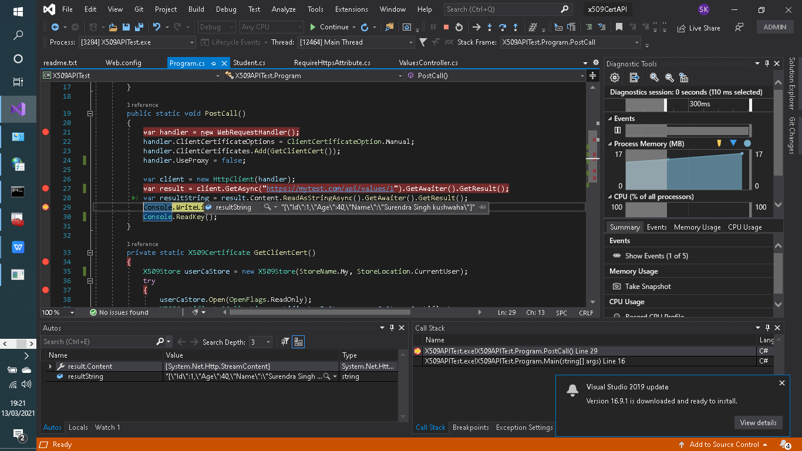

 
# Create a web API. 

# Description :

Use X509 Certificate Authentication to call  WEB API from Console Application. 
Certificate need to store on Client machine in any folder. Before making a call validate the certificate.
Web API data- Student [Id, Age, Name]
Console application Get Student(input Id)

# Solution:


Were X509APITest is a console application 
And X509CertAPI  is Web API
To keep it simple in X509CertAPI  project I have create one Student model with three property 
Id,  Age, Name
And a method GetAll() method that return dummy data of students 
```
using System;
using System.Collections.Generic;
using System.Linq;
using System.Web;

namespace x509CertAPI.Models
{
    public class Student
    {
        public int Id { get; set; }
        public int Age { get; set; }
        public string Name { get; set; }

        public List<Student> GetAll()
        {

            return new List<Student> { new Student {Id=1,Age=40, Name="Surendra Singh kushwaha" },
            new Student {Id=2,Age=40, Name="Haervinder singh sinddu" },
            new Student {Id=3,Age=42, Name="mahesh vinchu" },
            new Student {Id=4,Age=44, Name="Vijay thakre" },
            new Student {Id=5,Age=32, Name="Chand babu singh" }
        };
        }
    }
}
```
## And in X509CertAPI  is Web API Controllers/ValuesController
```
using System;
using System.Collections.Generic;
using System.Linq;
using System.Net;
using System.Net.Http;
using System.Web.Http;
using System.Web.Mvc;
using x509CertAPI.Models;

namespace x509CertAPI.Controllers
{
    public class ValuesController : ApiController
    {
        // GET api/values
        public IEnumerable<string> Get()
        {
            return new string[] { "value1", "value2" };
        }

        // GET api/values/5
        public Student Get(int id)
        {
            var sdudent = new Student().GetAll().SingleOrDefault(x => x.Id == id);
            return sdudent;
        }
        [RequireHttps]
        // POST api/values
        public void Post([FromBody] string value)
        {
          
        }

        // PUT api/values/5
        public void Put(int id, [FromBody] string value)
        {
        }

        // DELETE api/values/5
        public void Delete(int id)
        {
        }
    }
}
```

## And  X509APITest is a console application
```
using Newtonsoft.Json;
using System;
using System.Collections.Generic;
using System.Linq;
using System.Net.Http;
using System.Security.Cryptography.X509Certificates;
using System.Text;
using System.Threading.Tasks;
using System.Configuration;
using System.IO;

namespace X509APITest
{
    class Program
    {
        static void Main(string[] args)
        {
            PostCall();
        }

       //….code hide for batter clarity

       
    }
}
```
## Logic to change call for  used installed certificate or use local certificate file
```
 public static void PostCall()
        {
            var handler = new WebRequestHandler();
            handler.ClientCertificateOptions = ClientCertificateOption.Manual;
            var useLocalPathForCertificate = ConfigurationSettings.AppSettings["UseLocalPathForCertificate"];
            if (useLocalPathForCertificate == "true")
            {
                var localPathForCertificate = ConfigurationSettings.AppSettings["LocalPathForCertificate"];

                handler.ClientCertificates.Add(GetClientCertFromLocalPath(localPathForCertificate));
            }
            else
            {
                handler.ClientCertificates.Add(GetInstalledClientCert());
            }


            handler.UseProxy = false;

            var client = new HttpClient(handler);
            var result = client.GetAsync("https://mytest.com/api/values/1").GetAwaiter().GetResult();
            var resultString = result.Content.ReadAsStringAsync().GetAwaiter().GetResult();
            Console.WriteLine(resultString);
            Console.ReadKey();
        }
```

## Two method is created to access local certificate file or installed certificate
> - 1.GetInstalledClientCert()- when client certificate all ready installed in local machine. Then we use that method to get certificate.
> - 2.GetClientCertFromLocalPath(string certificateFilePath)- this method is called when we have certification file in specific location.

```
 private static X509Certificate GetInstalledClientCert()
        {
            X509Store userCaStore = new X509Store(StoreName.My, StoreLocation.CurrentUser);
            try
            {
                userCaStore.Open(OpenFlags.ReadOnly);
                X509Certificate2Collection certificatesInStore = userCaStore.Certificates;
                X509Certificate2Collection findResult = certificatesInStore.Find(X509FindType.FindBySubjectName, "mytest.com", true);
                X509Certificate2 clientCertificate = null;
                if (findResult.Count == 1)
                {
                    clientCertificate = findResult[0];
                }
                else
                {
                    throw new Exception("Unable to locate the correct client certificate.");
                }
                return clientCertificate;
            }
            catch
            {
                throw;
            }
            finally
            {
                userCaStore.Close();
            }
        }
        private static X509Certificate GetClientCertFromLocalPath(string certificateFilePath)
        {
            X509Certificate2 x509Certificate2 = null;
            try
            {
                x509Certificate2 = new X509Certificate2(Path.Combine(certificateFilePath, "mytestCA.pfx"), "1");
                if (x509Certificate2 != null)
                {
                    return x509Certificate2;
                }
                else
                {
                    throw new Exception("Unable to locate the file certificate.");
                }

            }
            catch
            {
                throw;
            }
        }
```

## Let worked on certificate
### For your under standing  we need some theory
A PFX file, also known as PKCS #12 , is a single, password protected certificate archive that contains the entire certificate chain plus the matching private key. Essentially it is everything that any server will need to import a certificate and private key from a single file

cer - certificate stored in the X. 509 standard format. ... pfx - stands for personal exchange format. It is used to exchange public and private objects in a single file.
makecert.exe only prompts for a password when you don't provide a private key.
Create a private key and the popup won't be displayed.
First we create a certificate with
makecert.exe, then we use pvk2pfx.exe to copy the public key and private key
information from the .pvk and .cer into a .pfx (personal information exchange) file.
<div style="background-color: #FFD800; color:black">NOTE: Never share your root .pvk or .pfx files if you want to stay secure!
The .pvk file contains your private key for your .cer certificate and the .pfx file contains both the certificate .cer and the private key .pvk, which means that others can sign new certificates with your certificate without your consent. The only file you can share is the .cer file, which only contains the public key.</div>


**For easiness  I am using password: 1**
*******************************************************************************
### Procedure
> - Open the Visual Studio command prompt as an Administrator.
> - Navigate to the folder where you want to create the certificate files.
> - To create a certificate and a private key file, run the following command. Its ask for password- given any password but remember 
``` 
C:\Users\SK.DESKTOP-DUN8VHF\source\repos\x509CertAPI>makecert.exe -n "CN=mytest.com" -r -sv mytestCA.pvk mytestCA.cer
Succeeded
```

*******************************************************************************
### Now create a client certificate that is signed by the first certificate:

```
C:\Users\SK.DESKTOP-DUN8VHF\source\repos\x509CertAPI>makecert.exe -pe -ss My -sr CurrentUser -a sha1 -sky exchange -n "CN=mytest.com"  -eku 1.3.6.1.5.5.7.3.2 -sk SignedByCA -ic mytestCA.cer -iv mytestCA.pvk
Succeeded
```
*******************************************************************************
### To convert the files into a .pfx file, run the following command:
create the .pfx file that you will use to sign your deployments. Open a Command Prompt window, and type the following command:
PVK2PFX –pvk yourprivatekeyfile.pvk –spc yourcertfile.cer –pfx yourpfxfile.pfx –po yourpfxpassword
``` 
C:\Users\SK.DESKTOP-DUN8VHF\source\repos\x509CertAPI>PVK2PFX -pvk mytestCA.pvk -spc mytestCA.cer -pfx mytestCA.pfx -po 1
 
C:\Users\SK.DESKTOP-DUN8VHF\source\repos\x509CertAPI>
```
*******************************************************************************


## To host application in  IIS
### Now time to use, so host x509CertAPI in IIS steps
> ### 1. right cliek on "sites" and  select "Add website" 
> ### 2. modal popup window give site name

>>

> ### 3.Also make entry in host file C:\Windows\System32\drivers\etc\Hosts
```
    #	127.0.0.1       localhost
    #	::1             localhost

    127.0.0.1	mytest.com www.mytest.com
```
> ### 4.Now its time to change binding

>>  

> ### 5.Now time to installed certificate.Now we have below file
mytestCA.pfx
mytestCA.cer
> ### 6.So we can installed or import mytestca.cer file in “Current User” certificate
> ### 7.And installed or import mytestca.pfx file in “Local computer” certificate Make sure both are in “trusted root certification authorities”

## How to Install SSL Certificate

There are total two certificates that you need to install and configure on your development machine,
> ### I.Install the Certificate.cer certificate in your Trusted Root Certification Authorities for the Local Machine store using MMC (right-click over the Trusted Root Certification Authorities folder | All Tasks | Import).

> ### II.Install the ClientCert.pfx certificate in the Personal store of Local Computer using MMC. Notice that the certificate shows it was issued by your Certificate Authority.
For more understanding about these certificate
Rum command widow type “MMC” 
>>  

> ### After “Add/Remove Snap-in…” option you need to select “Certificates” in below window.
>>  
>>  

> ### When you click on “Add>” button below screen appear
>>  
> ### You need to add  “my user Account” and “Computer Account” one by one[In our case optional, its only required when client application read x509 certificate from “current user” then its required].
> ### When you choose “Computer account”  you will see below screen
>>  
> ### just click on next. Below screen show two certificates inside the “Console root” and click “Ok” button
>>  

> ### Now you can import you certificate here,  in specific section

>>  

## Other Way To installed certificate
> ### Step1 .Double Click on mytestCA.pfx file
>>  
> ### Step2. click on “Next” button, and “File to Import” section click “Next”
>>  
> ### Step3  below window appear, give password and click “Next”
>>  
> ### Step4. Certificate Store section  browse store 
>>  
> ### Step5.Choose “Trusted Root Certificate Authorities” and click “OK”
>>  
> ### Step6.click “Next”
>>  
> ### Step7. Click on “Finish” 
>>  
<div style="background-color: #FFD800; color:black">Hint: in MMC [Local computer] Personal >certificates and Trusted Root Certification Authorities>certificates  both have mytestCA.com, in that case also work</div>

>> 
> ## Now we need to attach certificate in iis.
> ### I will tell you another way. IIS server selected then click “Server Certificates” icon

>> 

> ### In below window you need to click on “Import” link where you need to give your “mytestCA.pfx” file path and password.
>> 
> ### Also need to check in MMC, “Local Computer”  section you also make sure “mytest.com” should be in “Personal >Certificates” as well as “Trusted Root Certificate Authorities> Certificates”
> ### If not you can copy and pasted in  “Trusted Root Certificate Authorities> Certificates”
>> 
> ### Click on Ok button
> ### Now Select your web side and open binding setting and select SSL certificate, In our case its “mytest.com”
>> 
> ## Summarize MMC steps and IIS step about Certificate in brief
PFX Files & Windows Internet Information Service  (IIS)
A PKCS12 (PFX) file is a specially formatted file which includes the SSL Certificate, Private Key and optionally any required Intermediate CA Certificates. The file has an extension of .PFX and is compatible with Windows Internet Information Service (IIS).
The PKCS12 (PFX) file will be compressed and saved as a ZIP file, please ensure to UNZIP it before import. The (PKCS12) PFX file should include all required components (SSL Certificate, Private Key and any required Intermediate CA Certificates).
> ### How To Import The PKCS12 (PFX) File Into Microsoft IIS 
Importing a (PKCS12) PFX file into Microsoft IIS is generally a straight-forward process. Please review the instructions below or follow the instructions that are provided by Microsoft, refer to your server documentation or contact your server vendor.
> #### Step 1 : Click "Start" and choose "Run".
> #### Step 2 : In the "Run" dialogue box type "MMC" and click "OK". The MMC should then appear.
> #### Step 3 : Go to the File tab or menu and select "Add / Remove Snap-In".
> #### Step 4 : Click on "Certificates" and click "Add".
> #### Step 5 : Select "Computer Account" and click "Next".
> #### Step 6 : Select "Local Computer" and click "Finish".
> #### Step 7 : Click "OK" to close the "Add / Remove Snap-In" window.
> #### Step 8 : Double click on "Certificates (Local Computer)" in the center window.
> #### Step 9 : Right click on the "Personal Certificates Store" folder.
> #### Step 10 : Choose "ALL TASKS" then select "Import".
> #### Step 11 : Follow the "Certificate Import Wizard" to import your "Primary Certificate" from the .PFX file.
> #### Step 12 : Browse to the .PFX and enter the associated password when prompted.
> #### Step 13 : If desired, check the box to "Mark This Key As Exportable". We recommend choosing this option.
> #### Step 14 : When prompted, choose to automatically place the Certificates in the Certificate Stores based on the type of the Certificate.
> #### Step 15 : Click "Finish" to close the Certificate Import Wizard.
> #### Step 16 : also copy same certificate from “Personal>Certificates” section and paste it in “Trusted Root Certification Authorities> Certificates” section. 
> #### Step 17 : Close the MMC console. It is not necessary to save any changes that you have made to the MMC console.

> ## The SSL Certificate, Private Key and any Intermediate Certificates should now be imported into your server. You must now follow the instructions below to bind your SSL Certificate to your website profile.
> ### How To Bind An SSL Certificate In Microsoft IIS 
Once the SSL Certificate has been imported it is important to now bind the SSL Certificate to your website so that the website functions correctly. Your SSL Certificate will not function until the following steps are completed.
> #### Step 1 : Click "Start", "Administrative Tools" and then choose Internet Information Services (IIS) Manager.
> #### Step 2 : Click on the server name and expand the "Sites" folder.
> #### Step 3 : Locate your website (usually this will be called "Default Web Site") and click on it.
> #### Step 4 : From the "Actions" menu (on the right) click on "Site Bindings" or similar.
> #### Step 5. In the "Site Bindings" window, click "Add" or similar. This will open the "Add Site Binding" window.
> #### Step 6 : Under "Type" choose https. The IP address should be the corresponding dedicated IP address of the site or "All Unassigned". The "Port" which traffic will be secured by SSL is usually 443. The "SSL Certificate" field should specify the SSL Certificate that was installed during the import process above.
> #### Step 7 : Click "OK".
> #### Step 8 : Your SSL Certificate should now be installed and functioning correctly in conjunction with your website. Occasionally a restart of IIS may be required before the new SSL Certificate is recognized.

Now  visit the url  https://mytest.com/api/values
>> 
> ### Now we are good to test API call from console application
> ### API url will be
> #### https://mytest.com/api/values/1

>> 
>> 

